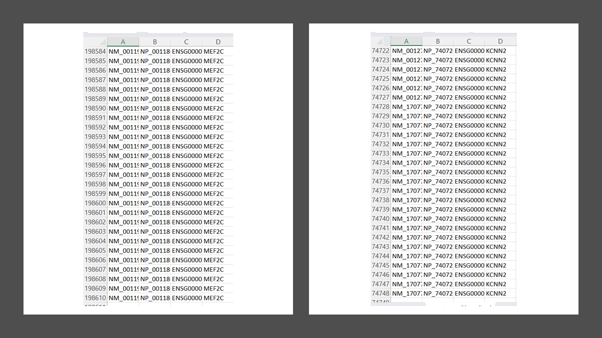

# Python Pipeline Tutorial to Query and Manipulate Data from BioMart and RefSeq in Order to Perform a Pairwise Alignment Between Two Species 

## Overview

The following tutorial gives a step-by-step guide on how to successfully use the pipeline in order to get the desired results. A more in-depth and commented script for this pipeline can be found in Google Colab as an .ipynb file by clicking on the badge. The script has also been provided as a .py file, which can be found above if running on another IDE besides Google Collab. Since this is a tutorial, the following code is not definitive and is capable of being changed or altered in order to include different attributes, filters, or databases.

[](https://colab.research.google.com/drive/1pH4O5FfuRbRmJvIbEOK8DeyZAchO6B_T?usp=sharing)

## Requirements

Step 1: Install and load all of the necessary packages in order for this pipeline to run successfully.

```Python
# This step only applies to installing in Google Collab
# If using another IDE, packages may need to be installed another way
!pip install pybiomart --quiet
!pip install biopython --quiet
```
```Python
from pybiomart import Dataset, Server
import pandas as pd
from Bio import Entrez, Align, SeqIO
from Bio.Align import substitution_matrices
```
## Selecting Marts

Step 2: Select a mart in order to access the Ensembl BioMart databases. All of the available marts can be accessed as a list and saved to a csv file. 

```Python
def mart_finder(file_name_1):
    server = Server(host='http://www.ensembl.org')
    list_1 = server.list_marts()
    list_1.to_csv(file_name_1, index=False)
```
When this function is called, it should output a file that looks similar to the one below.


## Ensembl BioMart Databases 

Step 3: After selecting a particular mart, use it to access all its corresponding Ensembl BioMart databases. All of the available datasets can be accessed as a list and saved to a csv file.

```Python
# A database represents a species
def database_finder(mart_name, file_name_2):
    server = Server(host='http://www.ensembl.org')
    mart = server[mart_name]
    list_2 = mart.list_datasets()
    list_2.to_csv(file_name_2, index=False)
```

When this function is called, it should output a file that looks similar to the one below.


## Filters and Attributes For a Specific Ensembl BioMart Database

Step 4: Find the filters for a specific database. The filters will vary to a degree depending on the dataset selected. All of the available filters for a particular species dataset can be accessed and saved to csv file.

```Python
# Filters are found for specified species
# This function is called twice (1 per different species)
def dataset_filters(species, file_1):
    species_dataset = Dataset(name=species, host='http://www.ensembl.org')
    list_1 = species_dataset.filters
    with open(file_1, 'w') as f:
        for item in list_1.keys():
            f.write("%s,%s\n" % (item, list_1[item]))
```  
 
When this function is called, it should output a filter file that looks similar to the one below.
 

 
Step 5: Find the attributes for a specific database. The attributes will vary to a degree depending on the dataset selected. All of the available attributes for a particular species dataset can be accessed and saved to csv file.
            
```Python
# Attributes are found for specified species
# This function is called twice (1 per different species)
def dataset_attributes(species, file_2):
    species_dataset = Dataset(name=species, host='http://www.ensembl.org')
    list_2 = species_dataset.attributes
    with open(file_2, 'w') as f:
        for item in list_2.keys():
            f.write("%s,%s\n" % (item, list_2[item]))
```  

When this function is called, it should output an attribute file that looks similar to the one below.


## Gather Data 

Step 6: Query data from a particular dataset based on specific attributes and filters in order to get specific queries. The queries for a particular species dataset can be saved as a csv file.

```Python
# In order to work with the data later on, all blanks must be removed and column names must be written in a way that makes them easy to manipulate.
# This function is called twice (1 per different species)
def dataset_retrieve(species, chrom, file_name):
    species_dataset = Dataset(name=species, host='http://www.ensembl.org')
     # Attributes are specified
    species_query = species_dataset.query(
        attributes=['refseq_mrna', 'refseq_peptide', 'ensembl_gene_id', 'external_gene_name', 'description',
                    'start_position', 'end_position', 'strand', 'chromosome_name', 'name_1006'],
        # Genes filtered by chromosomal location
        filters={'chromosome_name': [chrom]})
    filtered_set = species_query.dropna()
    filtered_set.columns = filtered_set.columns.str.replace(' ', '_')
    filtered_set.to_csv(file_name, index=False)
```

When this function is called, it should output a file that looks similar to the one below.


Step 7: Find all the homologs for the two species of interest in order to make a gene list.

```Python
def gene_list(species_1, chrom, species_2_id, species_2_gene_name, file_name):
    species_dataset = Dataset(name=species_1, host='http://www.ensembl.org')
    # Attributes include gene name and ID for species_1, and ID and gene name for corresponding homolog species
    gene_list_query = species_dataset.query(
        attributes=['ensembl_gene_id', 'external_gene_name', species_2_id, species_2_gene_name],
        filters={'chromosome_name': [chrom]})
    filtered_set = gene_list_query.dropna()
    filtered_set.columns = filtered_set.columns.str.replace(' ', '_')
    filtered_set.to_csv(file_name, index=False)
```
When this function is called, it should output a file that looks similar to the one below.


## Filter Data 

Step 8: Filter all of the datasets and gene lists so that they are reflective of one another. These updated datasets and gene lists can be saved as csv files.

Note: The dataset and gene list images shown in this section are screenshots and don't show all of the information. Their main purpose is to show the successful functionality of the functions with regards to data filtering.

```Python
# Queries are filtered out if they don't appear on the gene list for the first species dataset
def gene_list_dataset_1_filter(species, gene_list, species_filter, filter_gene):
    # Species_1 dataset selected
    dataset = pd.read_csv(species)
    # Uses gene list made from gene_list function
    genes = pd.read_csv(gene_list)
    list_1 = genes['Gene_name'].unique()
    dataset_query = dataset.query("Gene_name in @list_1")
    dataset_query.to_csv(species_filter, index=False)
    list_2 = dataset_query['Gene_name'].unique()
    genes_filter = genes.query("Gene_name in @list_2")
    genes_filter.to_csv(filter_gene, index=False)
```

```Python
# Queries are filtered out if they don't appear on the gene list for the second species dataset
def gene_list_dataset_2_filter(species, gene_list, column_name, file_name_1, file_name_2):
    # Species_2 dataset is selected
    dataset = pd.read_csv(species)
    # Uses gene list made from gene_list_dataset_1_filter function
    genes = pd.read_csv(gene_list)
    list_1 = genes[column_name].unique()
    dataset_query = dataset.query("Gene_stable_ID in @list_1")
    dataset_query.to_csv(file_name_1, index=False)
    list_2 = dataset_query['Gene_stable_ID'].unique()
    dataset_query_2 = genes[genes[column_name].isin(list_2)]
    dataset_query_2.to_csv(file_name_2, index=False)
```

When these functions are called, they should output files similar to the ones shown in the following images. The following images show a database and gene list before and after filtering. Most noticeably, the filtered files have fewer rows than the non-filtered files. 


```Python
# First species dataset is updated to reflect filtered second species dataset
def dataset_1_final_filter(species, gene_list, file_name):
    # Use species_1_filter from gene_list_dataset_1_filter function
    dataset = pd.read_csv(species)
    # Uses filter_gene_final from gene_list_dataset_2_filter function
    genes = pd.read_csv(gene_list)
    list_1 = list(genes['Gene_name'].unique())
    dataset_query = dataset.query("Gene_name in @list_1")
    dataset_query.to_csv(file_name, index=False)
```
When this function is called, it should output a file similar to the one shown in the following image. The following image shows a database before and after filtering. Similar to the previous two functions, the filtered dataset has fewer rows than the non-filtered dataset.



## Filter Data By Gene Ontology

Step 9: Filter species datasets by gene ontology term and save to a csv file.

```Python
# This function is called twice (1 per different species)
def gene_ontology_filter(file, go_term, go_name_filter):
    # Uses final filter datasets from gene_list_dataset_2_filter and dataset_1_final_filter functions
    filtered_species = pd.read_csv(file)
    query = filtered_species[filtered_species['GO_term_name'].isin([go_term])]
    query.to_csv(go_name_filter, index=False)
```

When this function is called, it should output a file that looks similar to the one below.


## Select Specified RefSeq

Step 10: Filter species datasets to get a gene of interest and save to a csv file. 

```Python
# This function is called twice (1 per different species)
def ref_seq_list(file_name, gene, column_name, name):
    # Uses files created from gene_ontology_filter
    file = pd.read_csv(file_name)
    filtered = file.loc[:, [column_name, "Gene_name"]]
    filtered.drop_duplicates(keep='first', inplace=True)
    list = [gene]
    desired_gene = filtered.query("Gene_name in @list")
    desired_gene.to_csv(name, index=False)
```

When this function is called, it should output a file that looks similar to the one below.


Step 11: Retrieve the desired RefSeq sequences from NCBI and save them to a fasta file.

```Python
# This function is called twice (1 per different species)
def ref_seq_sequence(email, db_type, id, file_name):
    Entrez.email = email
    # db can be nucleotide or protein and rettype can be fasta or gb
    net_handle = Entrez.efetch(db=db_type, id=id, rettype='fasta', retmode='text')
    out_handle = open(file_name, "w")
    out_handle.write(net_handle.read())
    out_handle.close()
    net_handle.close()
```

When this function is called, it should output a file that looks similar to the one below.


## Perform Pariwise Alignment

Step 12: View all of the available substitution matrices. 

```Python
def matrix():
    # Can be used in possible_pairwise_alignment and pairwise_alignment functions
    matrix_list = substitution_matrices.load()
    print('The following pre-defined matrices of', ', '.join(matrix_list), 'are available.')
```
When this function is called, it should output a statement that looks similar to the one below.


Step 13: Find all possible pairwise alignment variations between the two chosen sequences.

```Python
def possible_pairwise_alignment(open_gap, extend_gap, matrix, file_1, file_2):
    aligner = Align.PairwiseAligner()
    # Open and extended gap values should be entered as negative integers
    aligner.open_gap_score = open_gap
    aligner.extend_gap_score = extend_gap
    aligner.substitution_matrix = substitution_matrices.load(matrix)
    sequence_1 = SeqIO.read(file_1, "fasta")
    sequence_2 = SeqIO.read(file_2, "fasta")
    alignments = aligner.align(sequence_1, sequence_2)
    print("There are", len(alignments), "possible alignments.")
```
When this function is called, it should output a statement that looks similar to the one below.


Step 14: Perform pairwise alignment between two different sequences and save the results to a txt file.

```Python
def pairwise_alignment(open_gap, extend_gap, matrix, file_1, file_2, file_name, alignment):
    aligner = Align.PairwiseAligner()
    # Open and extended gap values should be entered as negative integers
    aligner.open_gap_score = open_gap
    aligner.extend_gap_score = extend_gap
    aligner.substitution_matrix = substitution_matrices.load(matrix)
    sequence_1 = SeqIO.read(file_1, "fasta")
    sequence_2 = SeqIO.read(file_2, "fasta")
    score = aligner.score(sequence_1.seq, sequence_2.seq)
    alignments = aligner.align(sequence_1, sequence_2)
    with open(file_name, 'w') as file:
        file.writelines(["Matrix:", ' ', str(matrix), '\n'])
        file.writelines(["Gap penalty:", ' ', str(abs(open_gap)), '\n'])
        file.writelines(["Extended penalty:", ' ', str(abs(extend_gap)), '\n'])
        file.writelines(["Score:", ' ', str(score), '\n'])
        file.writelines(['\n', str(alignments[alignment])])
```
When this function is called, it should output a file that looks similar to the one below.


## Function Arguments

Step 15: Call the functions in order to implement the pipeline and get the results that are mentioned above.

```Python
if __name__ == '__main__':
    mart_finder('mart_list.csv')
    database_finder('ENSEMBL_MART_ENSEMBL', 'database_list.csv')
    dataset_filters('hsapiens_gene_ensembl', 'h_filter.csv')
    dataset_filters('mmusculus_gene_ensembl', 'm_filter.csv')
    dataset_attributes('hsapiens_gene_ensembl', 'h_attrib.csv')
    dataset_attributes('mmusculus_gene_ensembl', 'm_attrib.csv')
    dataset_retrieve('hsapiens_gene_ensembl', '5', 'species_1.csv')
    dataset_retrieve('mmusculus_gene_ensembl', '18', 'species_2.csv')
    gene_list('hsapiens_gene_ensembl', '5', 'mmusculus_homolog_ensembl_gene', 'mmusculus_homolog_associated_gene_name',
              'genes.csv')
    gene_list_dataset_1_filter('species_1.csv', 'genes.csv', 'species_1_filter.csv', 'filtered_gene.csv')
    gene_list_dataset_2_filter('species_2.csv', 'filtered_gene.csv', 'Mouse_gene_stable_ID',
                               'species_2_filter_final.csv', 'filtered_gene_final.csv')
    dataset_1_final_filter('species_1_filter.csv', 'filtered_gene_final.csv', 'species_1_filter_final.csv')
    gene_ontology_filter('species_1_filter_final.csv', 'plasma membrane', 'species_1_go.csv')
    gene_ontology_filter('species_2_filter_final.csv', 'plasma membrane', 'species_2_go.csv')
    ref_seq_list('species_1_go.csv', 'APC', 'RefSeq_peptide_ID', 'species_1_ref.csv')
    ref_seq_list('species_2_go.csv', 'Apc', 'RefSeq_peptide_ID', 'species_2_ref.csv')
    ref_seq_sequence('nickolas.parker@maine.edu', 'protein', 'NP_001394379', 'H_APC_ref_seq.fasta')
    ref_seq_sequence('nickolas.parker@maine.edu', 'protein', 'NP_001347909', 'M_Apc_ref_seq.fasta')
    matrix()
    possible_pairwise_alignment(-10, -0.5, 'BLOSUM62', 'H_APC_ref_seq.fasta', 'M_Apc_ref_seq.fasta')
    pairwise_alignment(-10, -0.5, 'BLOSUM62', 'H_APC_ref_seq.fasta', 'M_Apc_ref_seq.fasta', 'alignment.txt', 0)
```    

